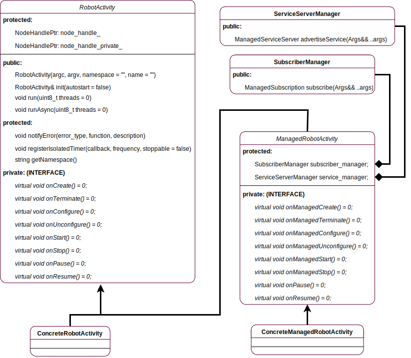

# robot_activity 
Copyright (C) 2017 - Maciej Żurad, University of Luxembourg

## Overview

ROS package, that implements **managed** nodes. Main features are:
- Controllable node lifecycle
- Automatically managed subscriptions and services during the life-cycle
- Easy integration with a node supervisor

UML diagram below shows the class hierarchy as well as the public interface.

## build.ros.org status

| indigo | kinetic | lunar | melodic |
| ------ |---------| ------|---------|
| |  |  | |

## Documentation

| [indigo](http://docs.ros.org/indigo/api/robot_activity/html/) | [kinetic](http://docs.ros.org/kinetic/api/robot_activity/html/) | [lunar](http://docs.ros.org/lunar/api/robot_activity/html/) | [melodic](http://docs.ros.org/melodic/api/robot_activity/html/) |
| ------ |---------| ------|---------|
