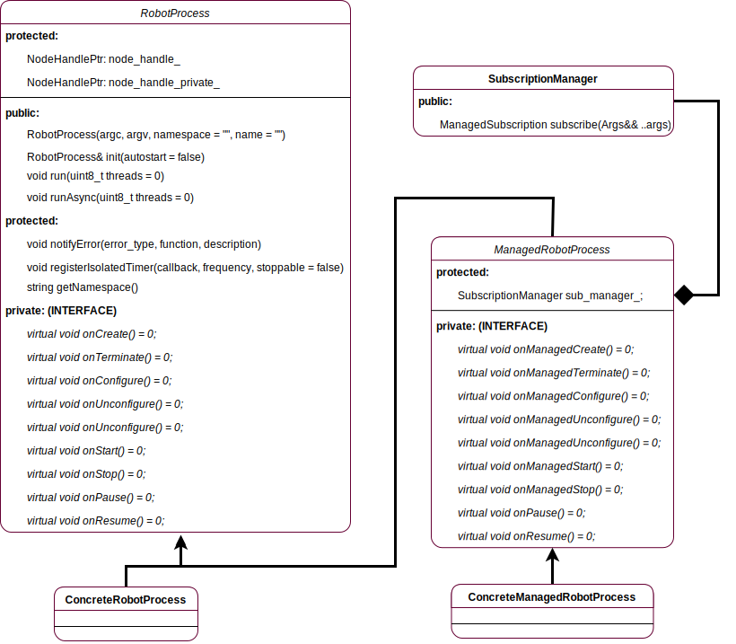

# robot_process
Copyright (C) 2017 - Maciej Żurad, University of Luxembourg

ROS packages, which implements **managed** nodes. Main features are:
- Controllable node lifecycle
- Automatically managed subscriptions and services during the life-cycle
- Easy integration with a node supervisor

## Overview

UML diagram below shows the class hierarchy as well as the public interface.

<!-- 
 -->

